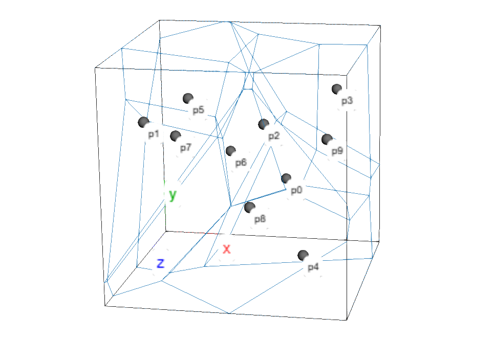

# pyvoro2

**pyvoro2** is a Python interface to the C++ library **Voro++** for computing
**3D tessellations** around a set of points:

- **Voronoi tessellations** (standard, unweighted)
- **power / Laguerre tessellations** (weighted Voronoi, via per-site radii)

The focus is not only on computing polyhedra, but on making the results *useful* in
scientific settings that are common in chemistry, materials science, and condensed
matter physics — especially **periodic boundary conditions** and **neighbor graphs**.

pyvoro2 is designed to be **honest and predictable**:

- it vendors and wraps an upstream Voro++ snapshot (with a small numeric robustness patch for power/Laguerre diagrams);
- the core tessellation modes are **standard Voronoi** and **power/Laguerre**.

## Quickstart

### 1) Standard Voronoi in a bounding box

For 3D visualization, install the optional dependency: `pip install "pyvoro2[viz]"`.

```python
import numpy as np
import pyvoro2 as pv
from pyvoro2.viz3d import view_tessellation

points = np.random.default_rng(0).uniform(-1.5, 1.5, size=(10, 3))
box = pv.Box(((-2, 2), (-2, 2), (-2, 2)))
cells = pv.compute(points, domain=box, mode='standard')

view_tessellation(
    cells,
    domain=box,
    show_vertices=False,
)
```



### 2) Power/Laguerre tessellation (weighted Voronoi)

```python
radii = np.full(len(points), 1.2)

cells = pv.compute(
    points,
    domain=box,
    mode='power',
    radii=radii,
    include_empty=True,  # power diagrams can have zero-volume cells
)
```

### 3) Periodic crystal cell with neighbor image shifts

```python
cell = pv.PeriodicCell(
    vectors=(
        (10.0, 0.0, 0.0),
        (2.0,  9.0, 0.0),
        (1.0,  0.5, 8.0),
    )
)

cells = pv.compute(points, domain=cell, return_face_shifts=True)

# Each face can include:
#   adjacent_cell  (neighbor id)
#   adjacent_shift (which periodic image produced the face)
```

## Numerical safety notes

Voro++ uses a few fixed absolute tolerances internally (most importantly a hard
near-duplicate check around ~`1e-5` in container distance units). For very small
or very large coordinate systems, this can lead to hard process termination or
loss of accuracy.

pyvoro2 does **not** silently rescale your coordinates. If you work in unusual
units, rescale explicitly before calling into the C++ layer.

As an additional safety net, you can ask pyvoro2 to run a fast Python-side
near-duplicate pre-check before entering the C++ layer:

```python
cells = pv.compute(points, domain=cell, duplicate_check='raise')
```

For stricter post-hoc checks, see:

- `pyvoro2.validate_tessellation(..., level='strict')`
- `pyvoro2.validate_normalized_topology(..., level='strict')`

Note: pyvoro2 vendors a small patch to Voro++ that inflates the stored global `max_radius`
by 1 ULP (via `nextafter`) in *power/Laguerre* mode. This makes Voro++'s internal radical
pruning slightly less aggressive, but avoids rare cross-platform edge cases where fully
periodic power tessellations could yield a non-reciprocal face/neighbor graph.

## Why use pyvoro2

Voro++ is fast and feature-rich, but it is a C++ library with a low-level API.
pyvoro2 aims to be a *scientific* interface that stays close to Voro++ while adding
practical pieces that are easy to get wrong:

- **triclinic periodic cells** (`PeriodicCell`) with robust coordinate mapping
- **partially periodic orthorhombic cells** (`OrthorhombicCell`) for slabs and wires
- optional **per-face periodic image shifts** (`adjacent_shift`) for building periodic graphs
- **diagnostics** and **normalization utilities** for reproducible topology work
- convenience operations beyond full tessellation:
  - `locate(...)` (owner lookup for arbitrary query points)
  - `ghost_cells(...)` (probe cell at a query point without inserting it)
  - inverse fitting utilities for **fitting power weights** from desired pairwise plane locations

## Documentation overview

The documentation is written as a short scientific tutorial: it starts with the
geometric ideas, then explains domains and operations, and only then dives into
implementation-oriented details.

| Section | What it contains |
|---|---|
| [Concepts](guide/concepts.md) | What Voronoi and power/Laguerre tessellations are, and what you can expect from them. |
| [Domains](guide/domains.md) | Which containers exist (`Box`, `OrthorhombicCell`, `PeriodicCell`) and how to choose between them. |
| [Operations](guide/operations.md) | How to compute tessellations, assign query points, and compute probe (ghost) cells. |
| [Topology and graphs](guide/topology.md) | How to build a neighbor graph that respects periodic images, and how normalization helps. |
| [Inverse fitting](guide/inverse.md) | Fit power/Laguerre radii from desired pairwise plane positions (with optional constraints/penalties). |
| [Visualization](guide/visualization.md) | Optional py3Dmol helpers for debugging and exploratory analysis. |
| [Examples (notebooks)](notebooks/01_basic_compute.ipynb) | End-to-end examples that combine the pieces above. |
| [API reference](reference/api.md) | The full reference (docstrings). |

## Installation

Most users should install a prebuilt wheel:

```bash
pip install pyvoro2
```

To build from source (requires a C++ compiler and Python development headers):

```bash
pip install -e .
```

## Testing

pyvoro2 uses **pytest**. The default test suite is intended to be fast and deterministic:

```bash
pip install -e ".[test]"
pytest
```

Additional test groups are **opt-in**:

- **Fuzz/property tests** (randomized):

  ```bash
  pytest -m fuzz --fuzz-n 100
  ```

- **Cross-check tests vs `pyvoro`** (requires installing `pyvoro` first):

  ```bash
  pip install pyvoro
  pytest -m pyvoro --fuzz-n 100
  ```

- **Slow tests** (if any are added in the future):

  ```bash
  pytest -m slow
  ```

Tip: you can combine markers, e.g. `pytest -m "fuzz and pyvoro" --fuzz-n 100`.

## Project status

pyvoro2 is currently in **beta**.

The core tessellation modes (standard and power/Laguerre) are stable, and a large
part of the work in this repository focuses on tests and documentation.
A future 1.0 release is planned once the inverse-fitting workflow is more mature
and native 2D support is added.

## AI-assisted development

Some parts of the implementation, tests, and documentation were developed with
AI assistance (OpenAI ChatGPT). The maintainer reviews and integrates changes,
and remains responsible for the resulting code and scientific claims.

Details are documented in the [AI usage](project/ai.md) page.

## License

- pyvoro2 is released under the **MIT License**.
- Voro++ is vendored and redistributed under its original license (see the project pages).
